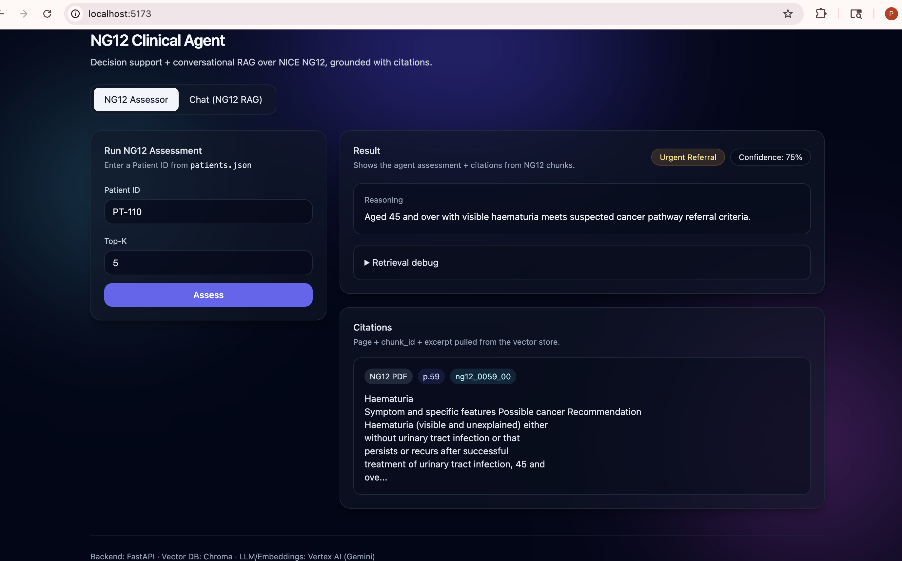
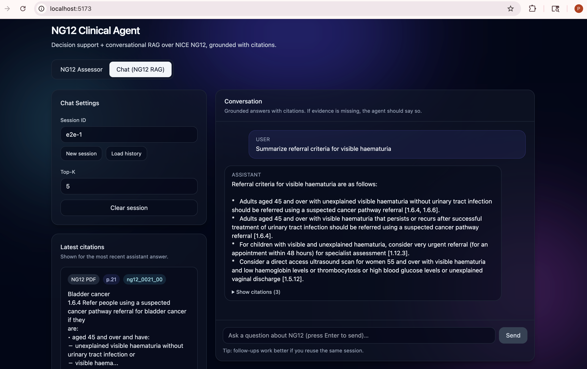
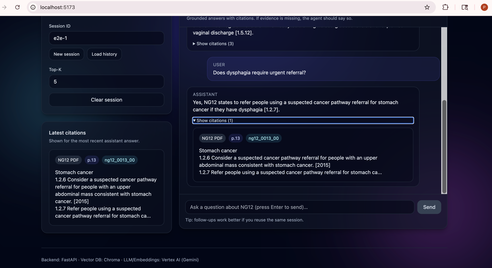

# NG12 Clinical Agent

A clinical decision support and conversational AI system built on NICE NG12 cancer referral guidelines.  
The system combines structured patient data with unstructured clinical guidance using a shared Retrieval-Augmented Generation (RAG) pipeline, grounded with explicit citations.

---

## 🔍 Project Overview

This project implements two tightly related capabilities:

1. **NG12 Cancer Risk Assessor**  
   Deterministic clinical decision support that evaluates whether a patient meets NICE NG12 criteria for urgent referral or investigation.

2. **Conversational NG12 RAG Agent**  
   A multi-turn chat interface that answers guideline questions using the same NG12 knowledge base, with strict grounding and citation requirements.

Both capabilities **reuse the same vector database, embeddings, and PDF ingestion outputs**, demonstrating a unified RAG architecture.

---

## 🖥️ User Interface

### NG12 Cancer Risk Assessor
The Assessor UI allows clinicians to input a Patient ID and receive an evidence-based
NG12 referral decision with guideline citations.



---

### Conversational NG12 Assistant
The Chat UI enables multi-turn clinical questioning over the NG12 guidelines,
reusing the same RAG pipeline and citation logic.



---

### Evidence & Citations
All clinical statements are grounded in retrieved NG12 passages with page-level citations.



## 🧠 Architecture Summary

**Backend**
- FastAPI (Python)
- ChromaDB (local vector database)
- Google Vertex AI (Gemini 1.5 + embeddings)
- Modular agent and service layers

**Frontend**
- React + TypeScript (Vite)
- TailwindCSS
- Minimal clinical UI focused on clarity and explainability

**Data Sources**
- `patients.json` – simulated structured patient records
- NICE NG12 PDF – parsed, chunked, embedded once during ingestion

---

## 🧩 Core System Flow

1. User provides input (Patient ID or question)
2. Structured data is retrieved via a tool call (patients.json)
3. Relevant NG12 guideline chunks are retrieved from ChromaDB
4. The LLM synthesizes an answer using only retrieved evidence
5. Output includes:
   - Decision or answer
   - Reasoning
   - Explicit NG12 citations (page + chunk)

---

## 🩺 Part 1: NG12 Cancer Risk Assessor

### UI Inputs
- **Patient ID** – identifies a record in `patients.json`
- **Top-K** – number of guideline chunks retrieved
- **Assess** – triggers the assessment pipeline

### Backend Logic
- Fetch patient demographics and symptoms
- Retrieve relevant NG12 sections based on symptoms
- Apply guideline-driven reasoning
- Output a structured assessment

### Output
- Assessment classification (Urgent Referral / Investigation / Unclear)
- Short clinical reasoning
- Confidence score derived from retrieval quality
- Guideline citations (NG12 page + chunk ID)

---

## 💬 Part 2: Conversational NG12 RAG

### Chat Capabilities
- Multi-turn conversations using session IDs
- Follow-up questions grounded in prior context
- Strict citation enforcement
- Guardrails against unsupported medical advice

### Supported Endpoints
- `POST /chat`
- `GET /chat/{session_id}/history`
- `DELETE /chat/{session_id}`

### Failure Behavior
If insufficient evidence is found in NG12, the agent explicitly responds:
> “I couldn’t find support in the NG12 guideline for this.”

---

## 🎯 Key Design Principles

- **Single RAG Pipeline** reused across decision support and chat
- **No hallucinated thresholds or treatments**
- **Explainability-first UI** (citations + retrieval debug)
- **Clinical safety guardrails**
- **Production-style modular backend**

---

## 🚀 Running the Project

### Backend
```bash
cd backend
python ingest_ng12.py     # One-time PDF ingestion
uvicorn app.main:app --reload

### Frontend
cd frontend
npm install
npm run dev